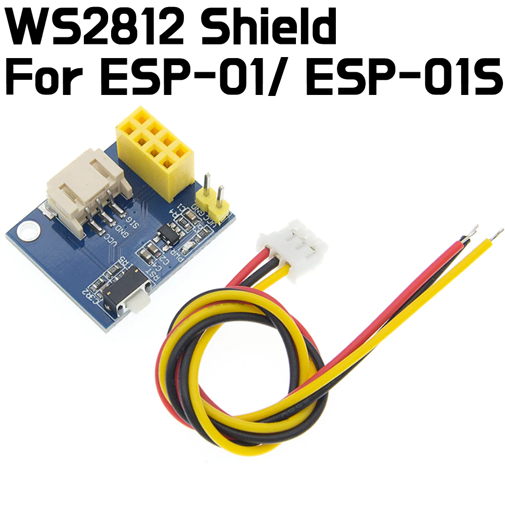
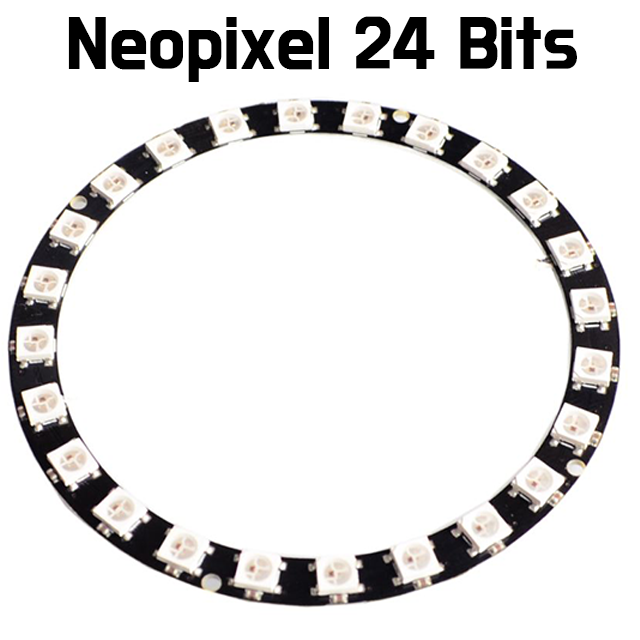
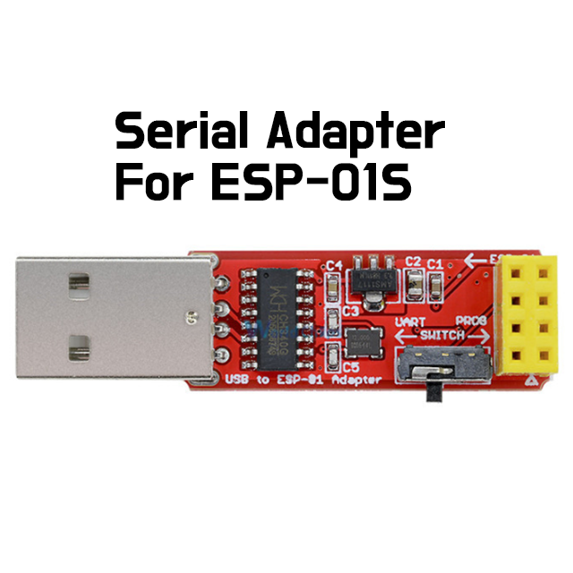
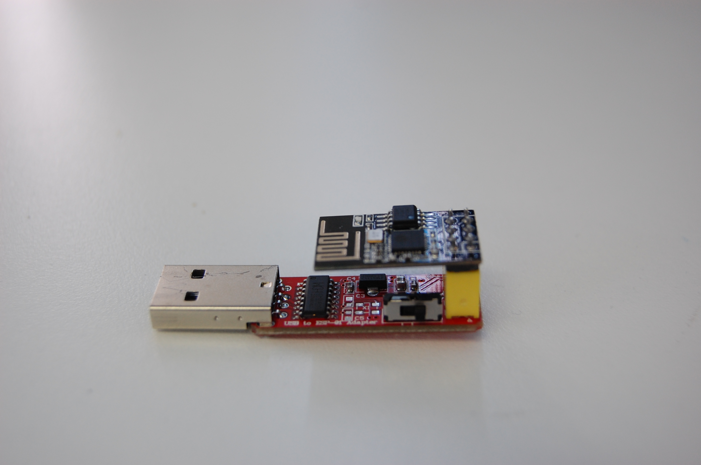
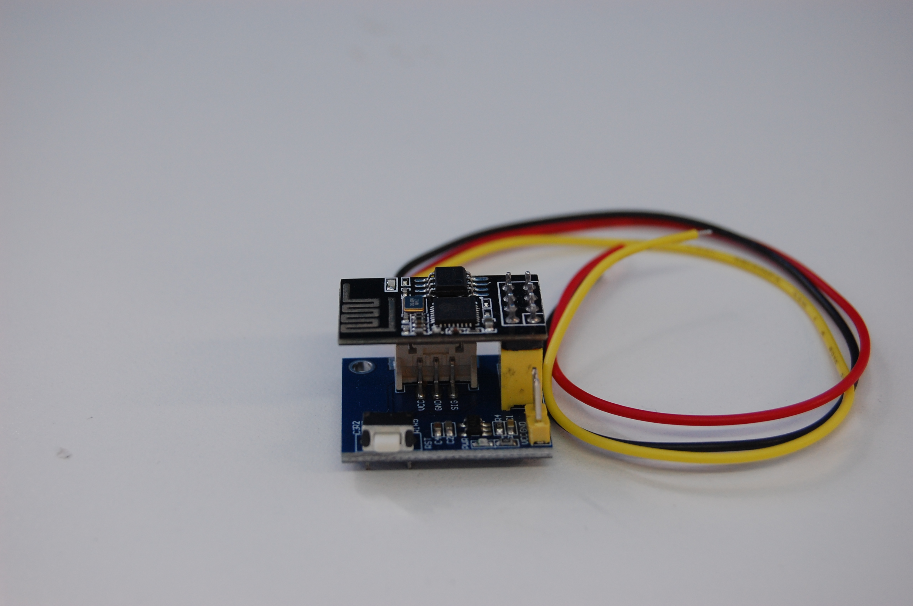
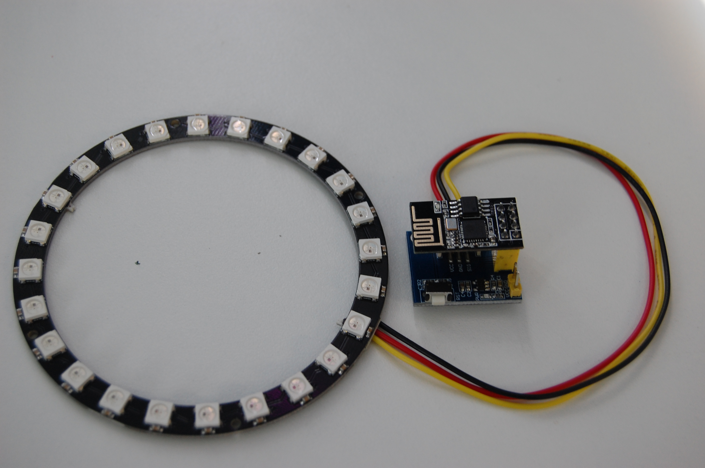
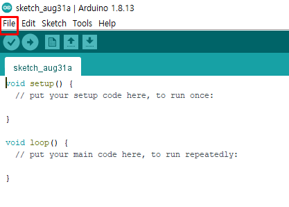
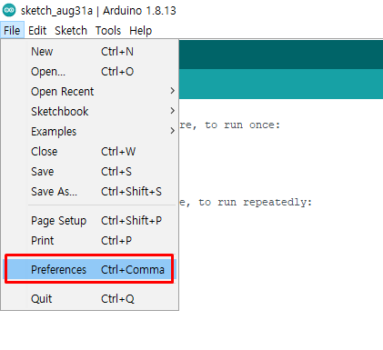
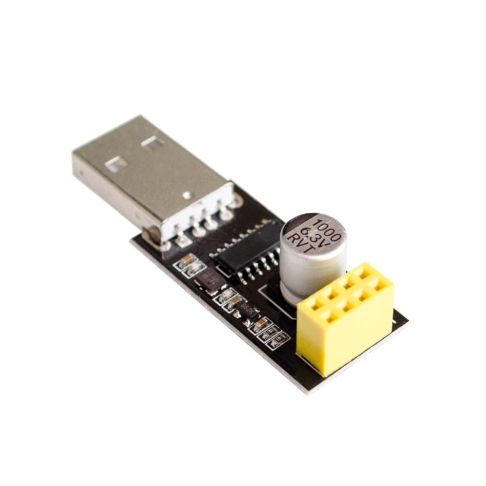
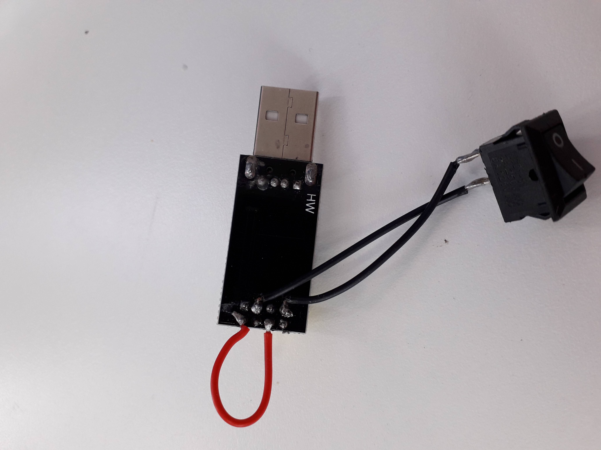

# WS2812 Adapter Shield for ESP-01 ESP-01S ESP8266

## Table of Contents
- [Intro](#intro)
- [Component](#component)
- [Connections](#connections)
- [Test Code](#test-code)
  - [Test result](#test-result)
- [Troubleshooting](#troubleshooting)
    
---

## Intro
This is a tutorial of ESP-01s with the WS2812 Module. The user will be able to control the WS2812 on the web or mobile after finishing this tutorial.
Please check the components for this tutorial.

For this tutorial, the ESP8266 board should be added to Arduino IDE.
---

## Component
* Please click the link with 'Ctrl' key or 'CMD' key, if you would like to open the link in a new tab!

|  |
| -- |
|[ESP-01s](https://www.trademe.co.nz/Browse/Listing.aspx?id=2759683051&bof=G6CBUiwo)|

|  |
| -- |
[WS2812 Shield](https://www.trademe.co.nz/Browse/Listing.aspx?id=2761938008&bof=vxvQgSXp)

|  |
| -- |
[NeoPixel 24 bits](https://www.trademe.co.nz/Browse/Listing.aspx?id=2757209144&bof=OCit0NAS)

|  |
| -- |
[USB to ESP-01s Programmer](https://nz.tradevine.com/epartners/Product/3693118140835795810/Photo)

---

## Connections
### ESP-01s Programmer module
|  |
| -- |
| ESP-01s with Programmer module |

### WS2812 Shield
|  |
| -- |
| WS2812 Shield with ESP-01s |

### WS2812 with ESP-01 & Shield
|  |
| -- |

| Shield | WS2812 |
| -- | -- |
| Red (VCC) | 5V |
| Black (GND) | GND |
| Yellow (Data) | Data In |

---

## Test Code
* For execution this code, Web control interface Files(HTML&JS) should be in the same folder with the below test code. The interface files is in the [Interface](Interface/) folder in this page.

```c++
/*
  WS2812FX Webinterface.
  
  Harm Aldick - 2016
  www.aldick.org

  
  FEATURES
    * Webinterface with mode, color, speed and brightness selectors


  LICENSE

  The MIT License (MIT)

  Copyright (c) 2016  Harm Aldick 

  Permission is hereby granted, free of charge, to any person obtaining a copy
  of this software and associated documentation files (the "Software"), to deal
  in the Software without restriction, including without limitation the rights
  to use, copy, modify, merge, publish, distribute, sublicense, and/or sell
  copies of the Software, and to permit persons to whom the Software is
  furnished to do so, subject to the following conditions:

  The above copyright notice and this permission notice shall be included in
  all copies or substantial portions of the Software.

  THE SOFTWARE IS PROVIDED "AS IS", WITHOUT WARRANTY OF ANY KIND, EXPRESS OR
  IMPLIED, INCLUDING BUT NOT LIMITED TO THE WARRANTIES OF MERCHANTABILITY,
  FITNESS FOR A PARTICULAR PURPOSE AND NONINFRINGEMENT. IN NO EVENT SHALL THE
  AUTHORS OR COPYRIGHT HOLDERS BE LIABLE FOR ANY CLAIM, DAMAGES OR OTHER
  LIABILITY, WHETHER IN AN ACTION OF CONTRACT, TORT OR OTHERWISE, ARISING FROM,
  OUT OF OR IN CONNECTION WITH THE SOFTWARE OR THE USE OR OTHER DEALINGS IN
  THE SOFTWARE.

  
  CHANGELOG
  2016-11-26 initial version
  2018-01-06 added custom effects list option and auto-cycle feature
  
*/
#include <ESP8266WiFi.h>
#include <ESP8266WebServer.h>
#include <WS2812FX.h>

extern const char index_html[];
extern const char main_js[];

#define WIFI_SSID "Replace_your_SSID"
#define WIFI_PASSWORD "Replace_your_password"

// #define STATIC_IP                       // uncomment for static IP, set IP below
// If you want to use static IP, please modify the ip & gateway
#ifdef STATIC_IP
  IPAddress ip(xxx,xxx,x,xx);
  IPAddress gateway(xxx,xxx,x,xxx);
  IPAddress subnet(255,255,255,0);
#endif

// QUICKFIX...See https://github.com/esp8266/Arduino/issues/263
#define min(a,b) ((a)<(b)?(a):(b))
#define max(a,b) ((a)>(b)?(a):(b))

#define LED_PIN 2                       // 0 = GPIO0, 2=GPIO2
#define LED_COUNT 100

#define WIFI_TIMEOUT 30000              // checks WiFi every ...ms. Reset after this time, if WiFi cannot reconnect.
#define HTTP_PORT 80

#define DEFAULT_COLOR 0xFF5900
#define DEFAULT_BRIGHTNESS 128
#define DEFAULT_SPEED 1000
#define DEFAULT_MODE FX_MODE_STATIC

unsigned long auto_last_change = 0;
unsigned long last_wifi_check_time = 0;
String modes = "";
uint8_t myModes[] = {}; // *** optionally create a custom list of effect/mode numbers
boolean auto_cycle = false;

WS2812FX ws2812fx = WS2812FX(LED_COUNT, LED_PIN, NEO_GRB + NEO_KHZ800);
ESP8266WebServer server(HTTP_PORT);

void setup(){
  Serial.begin(115200);
  delay(500);
  Serial.println("\n\nStarting...");

  modes.reserve(5000);
  modes_setup();

  Serial.println("WS2812FX setup");
  ws2812fx.init();
  ws2812fx.setMode(DEFAULT_MODE);
  ws2812fx.setColor(DEFAULT_COLOR);
  ws2812fx.setSpeed(DEFAULT_SPEED);
  ws2812fx.setBrightness(DEFAULT_BRIGHTNESS);
  ws2812fx.start();

  Serial.println("Wifi setup");
  wifi_setup();
 
  Serial.println("HTTP server setup");
  server.on("/", srv_handle_index_html);
  server.on("/main.js", srv_handle_main_js);
  server.on("/modes", srv_handle_modes);
  server.on("/set", srv_handle_set);
  server.onNotFound(srv_handle_not_found);
  server.begin();
  Serial.println("HTTP server started.");

  Serial.println("ready!");
}


void loop() {
  unsigned long now = millis();

  server.handleClient();
  ws2812fx.service();

  if(now - last_wifi_check_time > WIFI_TIMEOUT) {
    Serial.print("Checking WiFi... ");
    if(WiFi.status() != WL_CONNECTED) {
      Serial.println("WiFi connection lost. Reconnecting...");
      wifi_setup();
    } else {
      Serial.println("OK");
    }
    last_wifi_check_time = now;
  }

  if(auto_cycle && (now - auto_last_change > 10000)) { // cycle effect mode every 10 seconds
    uint8_t next_mode = (ws2812fx.getMode() + 1) % ws2812fx.getModeCount();
    if(sizeof(myModes) > 0) { // if custom list of modes exists
      for(uint8_t i=0; i < sizeof(myModes); i++) {
        if(myModes[i] == ws2812fx.getMode()) {
          next_mode = ((i + 1) < sizeof(myModes)) ? myModes[i + 1] : myModes[0];
          break;
        }
      }
    }
    ws2812fx.setMode(next_mode);
    Serial.print("mode is "); Serial.println(ws2812fx.getModeName(ws2812fx.getMode()));
    auto_last_change = now;
  }
}


/*
 * Connect to WiFi. If no connection is made within WIFI_TIMEOUT, ESP gets resettet.
 */
void wifi_setup() {
  Serial.println();
  Serial.print("Connecting to ");
  Serial.println(WIFI_SSID);

  WiFi.begin(WIFI_SSID, WIFI_PASSWORD);
  WiFi.mode(WIFI_STA);
  #ifdef STATIC_IP  
    WiFi.config(ip, gateway, subnet);
  #endif

  unsigned long connect_start = millis();
  while(WiFi.status() != WL_CONNECTED) {
    delay(500);
    Serial.print(".");

    if(millis() - connect_start > WIFI_TIMEOUT) {
      Serial.println();
      Serial.print("Tried ");
      Serial.print(WIFI_TIMEOUT);
      Serial.print("ms. Resetting ESP now.");
      ESP.reset();
    }
  }

  Serial.println("");
  Serial.println("WiFi connected");  
  Serial.print("IP address: ");
  Serial.println(WiFi.localIP());
  Serial.println();
}


/*
 * Build <li> string for all modes.
 */
void modes_setup() {
  modes = "";
  uint8_t num_modes = sizeof(myModes) > 0 ? sizeof(myModes) : ws2812fx.getModeCount();
  for(uint8_t i=0; i < num_modes; i++) {
    uint8_t m = sizeof(myModes) > 0 ? myModes[i] : i;
    modes += "<li><a href='#'>";
    modes += ws2812fx.getModeName(m);
    modes += "</a></li>";
  }
}

/* #####################################################
#  Webserver Functions
##################################################### */

void srv_handle_not_found() {
  server.send(404, "text/plain", "File Not Found");
}

void srv_handle_index_html() {
  server.send_P(200,"text/html", index_html);
}

void srv_handle_main_js() {
  server.send_P(200,"application/javascript", main_js);
}

void srv_handle_modes() {
  server.send(200,"text/plain", modes);
}

void srv_handle_set() {
  for (uint8_t i=0; i < server.args(); i++){
    if(server.argName(i) == "c") {
      uint32_t tmp = (uint32_t) strtol(server.arg(i).c_str(), NULL, 10);
      if(tmp >= 0x000000 && tmp <= 0xFFFFFF) {
        ws2812fx.setColor(tmp);
      }
    }

    if(server.argName(i) == "m") {
      uint8_t tmp = (uint8_t) strtol(server.arg(i).c_str(), NULL, 10);
      ws2812fx.setMode(tmp % ws2812fx.getModeCount());
      Serial.print("mode is "); Serial.println(ws2812fx.getModeName(ws2812fx.getMode()));
    }

    if(server.argName(i) == "b") {
      if(server.arg(i)[0] == '-') {
        ws2812fx.setBrightness(ws2812fx.getBrightness() * 0.8);
      } else if(server.arg(i)[0] == ' ') {
        ws2812fx.setBrightness(min(max(ws2812fx.getBrightness(), 5) * 1.2, 255));
      } else { // set brightness directly
        uint8_t tmp = (uint8_t) strtol(server.arg(i).c_str(), NULL, 10);
        ws2812fx.setBrightness(tmp);
      }
      Serial.print("brightness is "); Serial.println(ws2812fx.getBrightness());
    }

    if(server.argName(i) == "s") {
      if(server.arg(i)[0] == '-') {
        ws2812fx.setSpeed(max(ws2812fx.getSpeed(), 5) * 1.2);
      } else if(server.arg(i)[0] == ' ') {
        ws2812fx.setSpeed(ws2812fx.getSpeed() * 0.8);
      } else {
        uint16_t tmp = (uint16_t) strtol(server.arg(i).c_str(), NULL, 10);
        ws2812fx.setSpeed(tmp);
      }
      Serial.print("speed is "); Serial.println(ws2812fx.getSpeed());
    }

    if(server.argName(i) == "a") {
      if(server.arg(i)[0] == '-') {
        auto_cycle = false;
      } else {
        auto_cycle = true;
        auto_last_change = 0;
      }
    }
  }
  server.send(200, "text/plain", "OK");
}
```
---

## Troubleshooting

1. Check the installation of ESP8266 Add-on to Arduino IDE

|  |  |  |
| -- | -- | -- |

2. Failed to upload the code.

- Please check that your programmer module is programmer mode (Not UART)
- Check your connection between ESP-01 & FTDI programmer or USB serial adaptor.
- If you use USB serial adaptor, you need to do extra connection as below.

|  |  |  
| -- | -- |

---


