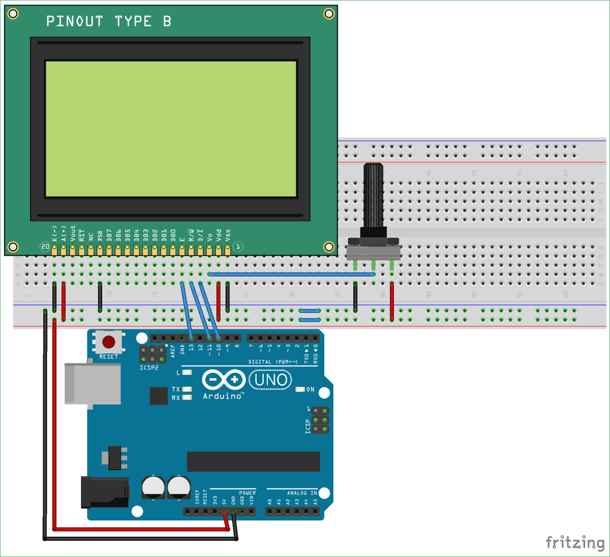
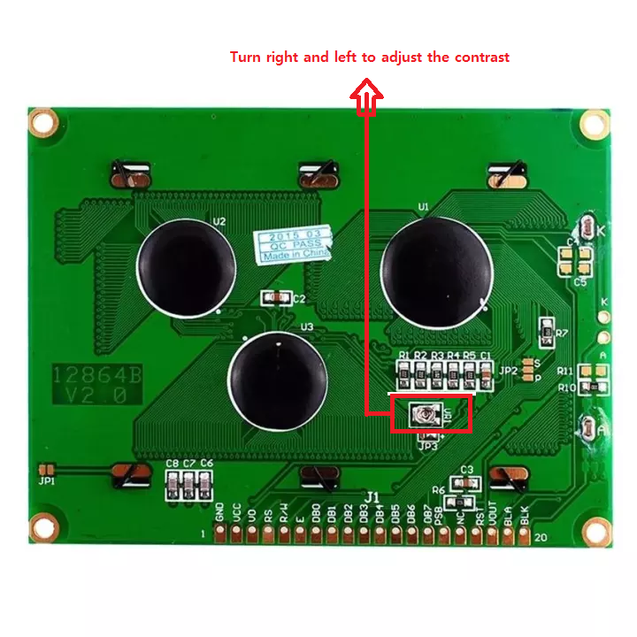

# LCD 12864(ST7920) 128X64 Blue 

## Disclaimer
This LCD module(ST7920) is a hardware SPI device which means we don't guarantee that LCD module works with I2C LCD adapter module.

## Intro
This is the test note of 12864 LCD(ST7920) 5V with a Arduino Uno board and 20K potentiometer. 
You may need a [library](Library/) for the LCD.

## Table of Contents
- [Component](#component)
- [Connections](#connections)
- [Test Code](#test-code)
  - [Test Video](#test-video)
- [Troubleshooting](#troubleshooting)
- [References](#references)
    
---

## Component
* Please click the link with 'Ctrl' key or 'CMD' key, if you would like to open the link in a new tab!

- [LCD 12864 5V Blue](https://www.trademe.co.nz/electronics-photography/other-electronics/electronic-components/other/listing-2674251906.htm?rsqid=f248778da94f48bfad3bd0bf9d65262a-001)
- [20K potentiometer](https://www.trademe.co.nz/electronics-photography/other-electronics/electronic-components/resistors/listing-2680508191.htm?rsqid=2790bf82c7544506a4586818294ec791-004)
- [Arduino Uno R3 MEGA328P CH340](https://www.trademe.co.nz/electronics-photography/other-electronics/electronic-components/other/listing-2651898157.htm?rsqid=929e0e9ffa584c05a4e74094cd4b87c6-004/)

---

## Connections
- Connect LCD pins to the arduino board as below

| LCD pins | Arduino |
| -- | --: |
| GND | GND |
| VCC | 5V |
| V0 | Connect to the potentiometer directly |
| RS | D10(digital pin) |
| R/W | D11(digital pin) |
| E | D13(digital pin) |
| PSB | GND |
| BLA | 5V |
| BLK | GND |

- Circuit Image

|  |
| -- |
|Source: https://circuitdigest.com/fullimage?i=circuitdiagram_mic/Interfacing-circuit-diagram-of-Graphical-LCD-with-Arduino.png |

## Test Code
* To test this example with arduino, you need to define the library used for the Graphical LCD. You can download the library [from this link.](https://bintray.com/olikraus/u8glib/Arduino/1.18.1)(or [library](Library/u8glib_arduino_v1.18.1.zip) folder in this page.)

```c++
#include "U8glib.h"

U8GLIB_ST7920_128X64_4X u8g(10);

const uint8_t rook_bitmap[] U8G_PROGMEM = {
  0x00, 0x00, 0x00, 0x00, 0x00, 0x00, 0x00, 0x00, 0x00, 0x00, 0x00, 0x00,
  0x00, 0x00, 0x00, 0x00, 0x00, 0x00, 0x00, 0x00, 0x00, 0x00, 0x70, 0x00,
  0x00, 0x0e, 0x00, 0x00, 0x00, 0x00, 0x00, 0x00, 0x00, 0x00, 0x00, 0x00,
  0x00, 0x70, 0x00, 0x00, 0x00, 0x00, 0x0c, 0x00, 0x00, 0x00, 0x00, 0x00,
  0x00, 0x00, 0x00, 0x00, 0x80, 0x01, 0x00, 0x00, 0x00, 0x00, 0x80, 0x01,
  0x00, 0x00, 0x00, 0x00, 0x00, 0x00, 0x00, 0x00, 0x18, 0x00, 0x00, 0x00,
  0x00, 0x00, 0x00, 0x10, 0x00, 0x00, 0x00, 0x00, 0x00, 0x00, 0x00, 0x00,
  0x01, 0x00, 0x00, 0x00, 0x00, 0x00, 0x00, 0x80, 0x01, 0x00, 0x00, 0x00,
  0x00, 0x00, 0x00, 0x20, 0x00, 0x00, 0x00, 0x00, 0x00, 0x00, 0x00, 0x00,
  0x0c, 0x00, 0x00, 0x00, 0x00, 0x00, 0x00, 0x04, 0x00, 0x00, 0x00, 0x00,
  0x00, 0x00, 0x00, 0x00, 0x20, 0x00, 0x00, 0x00, 0x00, 0x00, 0x80, 0x01,
  0x00, 0x00, 0xf0, 0xff, 0x3f, 0x00, 0x00, 0x00, 0x00, 0x01, 0x00, 0x00,
  0x00, 0x00, 0x60, 0x00, 0x00, 0xc0, 0xff, 0xff, 0x01, 0x27, 0x03, 0x00,
  0x00, 0x04, 0x00, 0x00, 0x00, 0x00, 0x18, 0x00, 0x00, 0x00, 0xfc, 0x3f,
  0xf8, 0x73, 0x3c, 0x00, 0x00, 0x10, 0x00, 0x00, 0x00, 0x00, 0x06, 0x00,
  0xc0, 0x7f, 0x00, 0x86, 0xff, 0xf3, 0xf1, 0x03, 0x00, 0x40, 0x00, 0x00,
  0x00, 0x00, 0x01, 0x00, 0xf8, 0xff, 0x3f, 0x00, 0xfe, 0xf9, 0xe3, 0x1f,
  0x00, 0x80, 0x01, 0x00, 0x00, 0x40, 0x00, 0x00, 0xfe, 0xff, 0x3f, 0x3c,
  0x00, 0xfc, 0xcf, 0x7f, 0x00, 0x00, 0x02, 0x00, 0x00, 0x20, 0x00, 0xc0,
  0xff, 0xff, 0x8f, 0xff, 0x1f, 0x00, 0x9f, 0xff, 0x01, 0x00, 0x04, 0x00,
  0x00, 0x10, 0x00, 0xf0, 0xff, 0xff, 0xe3, 0xff, 0xff, 0x1e, 0x00, 0xff,
  0x07, 0x00, 0x10, 0x00, 0x00, 0x0c, 0x00, 0xf8, 0xff, 0xff, 0xf9, 0xff,
  0x7f, 0xfe, 0x0f, 0x80, 0x1f, 0x00, 0x20, 0x00, 0x00, 0x02, 0x00, 0x00,
  0xff, 0x7f, 0xfc, 0xff, 0x3f, 0xff, 0x7f, 0x0c, 0x00, 0x00, 0x40, 0x00,
  0x00, 0x01, 0x00, 0x1f, 0x00, 0x3f, 0xff, 0xff, 0x3f, 0xff, 0xff, 0xfc,
  0x07, 0x00, 0x80, 0x00, 0x80, 0x00, 0xc0, 0xff, 0x1f, 0x80, 0xff, 0xff,
  0x9f, 0xff, 0xff, 0xf9, 0xff, 0x01, 0x00, 0x01, 0x80, 0x00, 0xe0, 0xff,
  0xff, 0x07, 0x80, 0xff, 0x9f, 0xff, 0xff, 0xf9, 0xff, 0x03, 0x00, 0x02,
  0x40, 0x00, 0xf0, 0xff, 0xff, 0xf3, 0x0f, 0xc0, 0xcf, 0xff, 0xff, 0xf3,
  0xff, 0x07, 0x00, 0x06, 0x20, 0x00, 0xf8, 0xff, 0xff, 0xf9, 0xff, 0x07,
  0xc0, 0xff, 0xff, 0xf3, 0xff, 0x0f, 0x00, 0x04, 0x30, 0x00, 0xf8, 0xff,
  0xff, 0xfc, 0xff, 0xff, 0x07, 0xc0, 0xff, 0xe3, 0xff, 0x1f, 0x00, 0x08,
  0x10, 0x00, 0xfc, 0xff, 0x7f, 0xfe, 0xff, 0xff, 0xe7, 0x03, 0xc0, 0xe7,
  0xff, 0x3f, 0x00, 0x08, 0xd0, 0xff, 0xff, 0xff, 0x7f, 0xff, 0xff, 0xff,
  0xff, 0xff, 0x83, 0xff, 0xff, 0xff, 0xff, 0x1f, 0x08, 0x00, 0x00, 0x00,
  0x00, 0x00, 0x00, 0x00, 0x00, 0x00, 0x00, 0x00, 0x00, 0x00, 0x00, 0x10,
  0x08, 0x00, 0x00, 0x00, 0x00, 0x00, 0x00, 0x00, 0x00, 0x00, 0x00, 0x00,
  0x00, 0x00, 0x00, 0x10, 0x08, 0x00, 0x00, 0x00, 0x00, 0x00, 0x00, 0x00,
  0x00, 0x00, 0x00, 0x00, 0x00, 0x00, 0x00, 0x20, 0x04, 0x61, 0x18, 0x42,
  0xfe, 0x7c, 0x40, 0x18, 0xe2, 0xf1, 0x23, 0xe0, 0x07, 0x8c, 0xfd, 0x21,
  0x84, 0x63, 0x1c, 0x36, 0x06, 0x8c, 0xc1, 0x18, 0x1b, 0x33, 0x36, 0x60,
  0x0c, 0x9c, 0x81, 0x21, 0x84, 0x73, 0x34, 0x0e, 0x06, 0xcc, 0x81, 0xbd,
  0x19, 0x32, 0x36, 0x60, 0x08, 0xbc, 0x61, 0x20, 0x84, 0x55, 0x26, 0x1e,
  0x06, 0x3c, 0x80, 0xe5, 0x19, 0xf2, 0x31, 0x60, 0x08, 0xe4, 0x31, 0x20,
  0x84, 0x4d, 0x7e, 0x36, 0x06, 0x6c, 0x00, 0xe7, 0x30, 0x33, 0x33, 0x60,
  0x0c, 0xc4, 0x1d, 0x20, 0x04, 0x48, 0x42, 0x42, 0xfa, 0x84, 0x00, 0x00,
  0xc0, 0x10, 0xc6, 0x8f, 0x03, 0x84, 0xe4, 0x21, 0x08, 0x00, 0x00, 0x00,
  0x00, 0x00, 0x00, 0x00, 0x00, 0x00, 0x00, 0x00, 0x00, 0x00, 0x00, 0x20,
  0x08, 0x00, 0x00, 0x00, 0x00, 0x00, 0x00, 0x00, 0x00, 0x00, 0x00, 0x00,
  0x00, 0x00, 0x00, 0x10, 0x08, 0x00, 0x00, 0x00, 0x00, 0x00, 0x00, 0x00,
  0x00, 0x00, 0x00, 0x00, 0x00, 0x00, 0x00, 0x10, 0x10, 0x00, 0xfe, 0xff,
  0xef, 0xff, 0xe0, 0xef, 0xff, 0xff, 0x7f, 0xfe, 0xff, 0x3f, 0x00, 0x18,
  0x10, 0x00, 0xfc, 0xff, 0xe7, 0xff, 0x03, 0xe0, 0xff, 0xff, 0x3f, 0xfe,
  0xff, 0x1f, 0x00, 0x08, 0x20, 0x00, 0xf8, 0xff, 0xef, 0xff, 0xff, 0x03,
  0xf0, 0xff, 0x1f, 0xff, 0xff, 0x1f, 0x00, 0x08, 0x20, 0x00, 0xf0, 0xff,
  0xcf, 0xff, 0xff, 0xf3, 0x01, 0xf0, 0xcf, 0xff, 0xff, 0x0f, 0x00, 0x04,
  0x40, 0x00, 0xe0, 0xff, 0xcf, 0xff, 0xff, 0xf9, 0xff, 0x00, 0xe0, 0xff,
  0xff, 0x07, 0x00, 0x02, 0x80, 0x00, 0xc0, 0xff, 0x9f, 0xff, 0xff, 0xf9,
  0xff, 0xff, 0x00, 0xf8, 0xff, 0x03, 0x00, 0x03, 0x00, 0x01, 0x00, 0xf0,
  0x9f, 0xff, 0xff, 0xfc, 0xff, 0xff, 0x78, 0x00, 0xf8, 0x01, 0x00, 0x01,
  0x00, 0x03, 0x00, 0x00, 0x38, 0xff, 0xff, 0xfc, 0xff, 0x7f, 0xfc, 0x7f,
  0x00, 0x00, 0x80, 0x00, 0x00, 0x06, 0x00, 0xfc, 0x00, 0xf8, 0x7f, 0xfe,
  0xff, 0x1f, 0xff, 0xff, 0x3f, 0x00, 0x40, 0x00, 0x00, 0x08, 0x00, 0xf0,
  0x7f, 0x00, 0x7c, 0xfe, 0xff, 0xc7, 0xff, 0xff, 0x0f, 0x00, 0x30, 0x00,
  0x00, 0x10, 0x00, 0xc0, 0xff, 0x7c, 0x00, 0xfc, 0xff, 0xe1, 0xff, 0xff,
  0x03, 0x00, 0x08, 0x00, 0x00, 0x20, 0x00, 0x00, 0xff, 0xf1, 0x3f, 0x00,
  0x7c, 0xf8, 0xff, 0xff, 0x00, 0x00, 0x04, 0x00, 0x00, 0x80, 0x00, 0x00,
  0xfc, 0xe3, 0x9f, 0x3f, 0x00, 0xfe, 0xff, 0x3f, 0x00, 0x00, 0x03, 0x00,
  0x00, 0x00, 0x01, 0x00, 0xe0, 0xcf, 0x9f, 0xff, 0x03, 0x00, 0xfe, 0x07,
  0x00, 0x80, 0x00, 0x00, 0x00, 0x00, 0x04, 0x00, 0x00, 0x1f, 0xcf, 0x7f,
  0xf8, 0x1f, 0x00, 0x00, 0x00, 0x20, 0x00, 0x00, 0x00, 0x00, 0x10, 0x00,
  0x00, 0x70, 0xee, 0x03, 0xff, 0xff, 0x0f, 0x00, 0x00, 0x18, 0x00, 0x00,
  0x00, 0x00, 0x40, 0x00, 0x00, 0x00, 0x00, 0xe0, 0xff, 0x7f, 0x00, 0x00,
  0x00, 0x06, 0x00, 0x00, 0x00, 0x00, 0x00, 0x01, 0x00, 0x00, 0x00, 0xfe,
  0x3f, 0x00, 0x00, 0x00, 0x80, 0x00, 0x00, 0x00, 0x00, 0x00, 0x00, 0x0c,
  0x00, 0x00, 0x00, 0x00, 0x00, 0x00, 0x00, 0x00, 0x30, 0x00, 0x00, 0x00,
  0x00, 0x00, 0x00, 0x60, 0x00, 0x00, 0x00, 0x00, 0x00, 0x00, 0x00, 0x00,
  0x04, 0x00, 0x00, 0x00, 0x00, 0x00, 0x00, 0x00, 0x03, 0x00, 0x00, 0x00,
  0x00, 0x00, 0x00, 0xc0, 0x00, 0x00, 0x00, 0x00, 0x00, 0x00, 0x00, 0x00,
  0x30, 0x00, 0x00, 0x00, 0x00, 0x00, 0x00, 0x08, 0x00, 0x00, 0x00, 0x00,
  0x00, 0x00, 0x00, 0x00, 0x00, 0x03, 0x00, 0x00, 0x00, 0x00, 0xc0, 0x00,
  0x00, 0x00, 0x00, 0x00, 0x00, 0x00, 0x00, 0x00, 0x00, 0xc0, 0x00, 0x00,
  0x00, 0x00, 0x03, 0x00, 0x00, 0x00, 0x00, 0x00, 0x00, 0x00, 0x00, 0x00,
  0x00, 0x00, 0xc0, 0x0f, 0xe0, 0x03, 0x00, 0x00, 0x00, 0x00, 0x00, 0x00,
  0x00, 0x00, 0x00, 0x00, 0x00, 0x00, 0x00, 0x00, 0x00, 0x00, 0x00, 0x00,
  0x00, 0x00, 0x00, 0x00
};

void draw(void) {

  //u8g.setFont(u8g_font_unifont);
  u8g.setFont(u8g_font_osb18);
  u8g.drawStr( 04, 27, "Hello,");
  u8g.setFont(u8g_font_unifont);
  u8g.drawStr( 04, 52, "MakerWorld NZ");
}

void picture(void) {
  u8g.drawXBMP( 0, 0, 128, 64, rook_bitmap);
}

void next(void) {

  u8g.setFont(u8g_font_unifont);
  //u8g.setFont(u8g_font_osb18);
  u8g.drawStr( 07, 18, "Interfacing");
  u8g.drawStr( 07, 38, "Graphical LCD");
  u8g.drawStr( 07, 58, "with Arduino");
}

void clearLCD() {
  u8g.firstPage();
  do {
  } while ( u8g.nextPage() );
}

void setup(void) {

  // assign default color value
  if ( u8g.getMode() == U8G_MODE_R3G3B2 ) {
    u8g.setColorIndex(255);     // white
  }
  else if ( u8g.getMode() == U8G_MODE_GRAY2BIT ) {
    u8g.setColorIndex(3);         // max intensity
  }
  else if ( u8g.getMode() == U8G_MODE_BW ) {
    u8g.setColorIndex(1);         // pixel on
  }
  else if ( u8g.getMode() == U8G_MODE_HICOLOR ) {
    u8g.setHiColorByRGB(255, 255, 255);
  }
}

void loop(void) {
  // picture loop
  u8g.firstPage();
  do {
    u8g.drawFrame(1, 2, 126, 62);
    draw();
  } while ( u8g.nextPage() );
  delay(2000);
  clearLCD();
  u8g.firstPage();
  do {
    u8g.drawFrame(1, 2, 126, 62);
    next();
  } while ( u8g.nextPage() );
  delay(2000);
  clearLCD();
  u8g.firstPage();
  do {
    picture();
  } while ( u8g.nextPage() );
  delay(3000);
  clearLCD();
  // rebuild the picture after some delay
  delay(50);
}
```
| Source: [https://circuitdigest.com/microcontroller-projects/graphical-lcd-interfacing-with-arduino](https://circuitdigest.com/microcontroller-projects/graphical-lcd-interfacing-with-arduino) |
| -- |


### Test result
- Please see the [result video](https://drive.google.com/file/d/10IwR3n_r5GYJIw9jlE2LlriZe4FYd9Mv/view?usp=sharing) (click the link)


## Troubleshooting

- Check the pinout
  - To test above example, you have to check the pinout correctly.

- Contrast adjustment
  - If you don't have a potentiometer, you can adjust the contrast by the
  built-in potentiometer 

  |  |
  | -- |

- Adding the [library](Library/u8glib_arduino_v1.18.1.zip)
  - Please check that library added correctly.
---

## References
- Site:
  - [https://playground.arduino.cc/Code/LCD12864](https://playground.arduino.cc/Code/LCD12864)
  - [https://circuitdigest.com/microcontroller-projects/graphical-lcd-interfacing-with-arduino](https://circuitdigest.com/microcontroller-projects/graphical-lcd-interfacing-with-arduino)

- Data Sheet
  - [https://www.vishay.com/docs/37329/37329.pdf](https://www.vishay.com/docs/37329/37329.pdf)
  - [https://www.lcd-module.de/eng/pdf/zubehoer/st7920_chinese.pdf](https://www.lcd-module.de/eng/pdf/zubehoer/st7920_chinese.pdf)