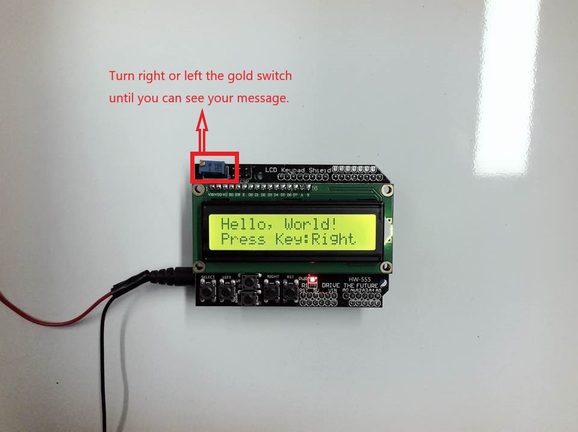

# LCD 1602 Keypad Shield

This is the test note of LCD 1602 Keypad Shield & Arduino Uno.

## Table of Contents
- [Component](#component)
- [Connections](#connections)
- [Test Code](#test-code)
- [Troubleshooting](#troubleshooting)
- [References](#references)
    
---
## Component
* Please click the link with 'Ctrl' key or 'CMD' key, if you would like to open the link in a new tab!

- [LCD 1602 Keypad Shield](https://www.trademe.co.nz/electronics-photography/other-electronics/electronic-components/other/listing-2660227290.htm?rsqid=17e6cdd8912946ddb21d69d4c7f96e04-001)
- [Arduino Uno R3 MEGA328P CH340](https://www.trademe.co.nz/electronics-photography/other-electronics/electronic-components/other/listing-2651898157.htm?rsqid=929e0e9ffa584c05a4e74094cd4b87c6-004/)

---

## Connections
- This module can be combined with Arduino Uno, Arduino Mega2560.

## Test Code
*  The necessary library is a default library on Arduino IDE.

```c++
#include <LiquidCrystal.h>
//LCD pin to Arduino
const int pin_RS = 8; 
const int pin_EN = 9; 
const int pin_d4 = 4; 
const int pin_d5 = 5; 
const int pin_d6 = 6; 
const int pin_d7 = 7; 
const int pin_BL = 10; 
LiquidCrystal lcd( pin_RS,  pin_EN,  pin_d4,  pin_d5,  pin_d6,  pin_d7);
void setup() {
 lcd.begin(16, 2);
 lcd.setCursor(0,0);
 lcd.print("Hello, World!");
 lcd.setCursor(0,1);
 lcd.print("Press Key:");
}
void loop() {
 int x;
 x = analogRead (0);
 lcd.setCursor(10,1);
 if (x < 60) {
   lcd.print ("Right ");
 }
 else if (x < 200) {
   lcd.print ("Up    ");
 }
 else if (x < 400){
   lcd.print ("Down  ");
 }
 else if (x < 600){
   lcd.print ("Left  ");
 }
 else if (x < 800){
   lcd.print ("Select");
 }
} 

void loop()
{
  
}
```
* For more testing code, please see the [references](#references) sites below.

## Troubleshooting
|  |
| -- |
| If you cannot see any message on LCD display, try to adjust potentiometer as above |


## References
- Site:
  - http://bit.ly/1602-LCD-Keypad-Shield(http://bit.ly/1602-LCD-Keypad-Shield)
  - http://bit.ly/1602-LCD-Keypad-Shield-for-Arduino(http://bit.ly/1602-LCD-Keypad-Shield-for-Arduino)
  - https://www.youtube.com/watch?v=ANDxSYrKK1Q(https://www.youtube.com/watch?v=ANDxSYrKK1Q)
  - https://create.arduino.cc/projecthub/electropeak/using-1602-lcd-keypad-shield-w-arduino-w-examples-e02d95(https://create.arduino.cc/projecthub/electropeak/using-1602-lcd-keypad-shield-w-arduino-w-examples-e02d95)
  - http://www.eurowebcart.ru/index.php?page=arduino(http://www.eurowebcart.ru/index.php?page=arduino)
