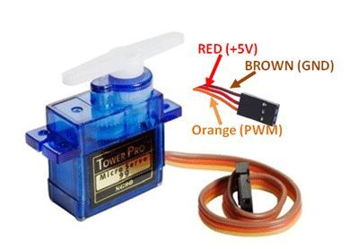

# SG90 360 Degree Continuous Rotation Servo

## Table of Contents
- [Descriptions](#descriptions)
- [Specifications](#specifications)
- [Components](#components)
- [Testing](#Testing)
  - [Connections](#connections)
  - [Test Code](#test-code)
  - [Troubleshooting](#troubleshooting)
- [Reference](#reference)
    
---

## Descriptions (Important Information)
This servo motor's operation is more similar to an ordinary DC motor than a standard servo motor which means <strong>this servo has no positional awareness so that shaft can rotate freely.</strong>
And this servo motor does not require additional motor drivers and is plug and play. Please see the following example code.

## Specifications
- Dimensions: 22.6 x 12.2 x 30 mm /0.89x0.48x1.18”
- Weight: 9±1g
- Supply Voltage: 4.8V ~ 6.0V
- Operating Voltage: 3.5 - 6.0V
- Stall Torque: 1.2kg/cm (4.8V), 1.6kg/cm (6.0V)
- Working Speed: 0.12sec/60 (4.8V no load)
- Dead Zone Width: 5usec
- Neutral Location: 1500us
- Operating Temperature: -30°C to + 60°C
- Rotation angle: 360 degree <strong>(Continouos)</strong>

- Interface Description:
- <span style="color: brown">Brown</span>: GND(Negative)
- <span style="color: red">Red</span>: VCC(Positive)
- <span style="color: orange">Orange</span>: PWM(Signal)
- Cable Length: 250mm

## Component
* Please click the link with 'Ctrl' key or 'CMD' key, if you would like to open the link in a new tab!

- [Servo SG90 360 Degree Continuous Rotation](https://www.trademe.co.nz/electronics-photography/other-electronics/electronic-components/other/listing-2688221487.htm?rsqid=53c0ceb0b4ad48338dc0187e53b97757-001)

- [Arduino Uno R3 MEGA328P CH340](https://www.trademe.co.nz/electronics-photography/other-electronics/electronic-components/other/listing-2651898157.htm?rsqid=929e0e9ffa584c05a4e74094cd4b87c6-004/)

---

## Testing

## Connections
### Interface Description:
- <span style="color: brown">Brown</span>: GND(Negative)
- <span style="color: red">Red</span>: VCC(Positive)
- <span style="color: orange">Orange</span>: PWM(Signal)

|  |
| -- |
| Pinout of this servo motor is the same with standard servo motor |

## Test Code
* This example needs just standard servo library on Arduino IDE.

```c++
#include <Servo.h> // Include standard servo library

Servo myservo;  // create servo object to control a servo

char incomingChar; // for incoming serial data

void setup() {
  Serial.begin(9600); // opens serial port, sets data rate to 9600 bps
  myservo.attach(6); // connect servo motor to the pin 6 of Arduino board
}

void loop() {
  // send data only when you receive data:
  if (Serial.available() > 0) {
    // read the incoming byte:
    incomingChar = Serial.read();

    if(incomingChar == 'w') {
      myservo.writeMicroseconds(700); // to rotate to the clockwise
      Serial.println("Clockwise");
    }
    else if(incomingChar == 's') { // to stop rotating
      myservo.writeMicroseconds(1500);
      Serial.println("Stop");
    }
    else if(incomingChar == 'c') { // to rotate to the counterclockwise
      myservo.writeMicroseconds(2300);
      Serial.println("CounterClockWise");
    }
  }
}


```

## Troubleshooting
- As above [descriptions](#descriptions), this servo does not have positional awareness and no hardware stop inside. Please see the [reference](#references) site below for understanding this servo.

- when you test example code, you need to open the serial window and input a character as above.

## Reference
- Site:
  - [https://www.arduino.cc/reference/en/language/functions/communication/serial/read](https://www.arduino.cc/reference/en/language/functions/communication/serial/read)

- Test Video
  - [Click to see the test video](https://drive.google.com/file/d/1WNDMLJ3FdN_86I3_VEULPO_GIDZKZ74j/view?usp=sharing)

  If you can't see the video on the google drive, plese click the 'open with Video Player for Google Drive' under the download menu.
