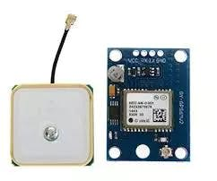
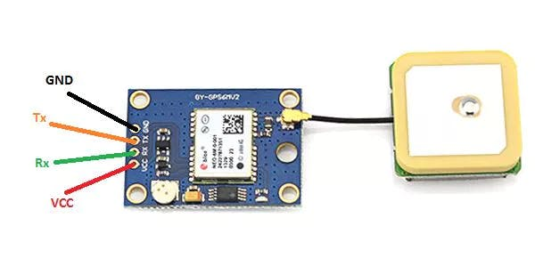

# GY-NEO6MV2 (GPS Module)

## Table of Contents
- [Intro](#intro)
- [Component](#component)
- [Connections](#connections)
- [Test Code](#test-code)
  - [Test result](#test-result)
- [Troubleshooting](#troubleshooting)
- [References](#references)
    
---

## Intro
The NEO-6M GPS module is shown in the figure below.<br/>
<br/>
It comes with an external antenna and does not come with header pins. So you will need to solder it.<br/>
To test the example below, you may need some [libraries](Library/) in the [Library](Library/) folder.

---

## Component
* Please click the link with 'Ctrl' key or 'CMD' key, if you would like to open the link in a new tab!

- [GY-NEO6MV2 (GPS Module)](https://www.trademe.co.nz/electronics-photography/other-electronics/electronic-components/other/listing-2675623928.htm?rsqid=59019109183e48c6b9adc939d6defd37-002)
- [Arduino Uno R3 MEGA328P CH340](https://www.trademe.co.nz/electronics-photography/other-electronics/electronic-components/other/listing-2651898157.htm?rsqid=929e0e9ffa584c05a4e74094cd4b87c6-004/)

---

## Connections
### GPS pinout
|  |
| -- |


### Circuit Image
|  |
| -- |
| Source: https://create.arduino.cc/projecthub/ruchir1674/how-to-interface-gps-module-neo-6m-with-arduino-8f90ad#toc-1--information-about-gps-0 |

---

## Test Code
* To test this example with arduino, you need to define the libraries used for the GPS module. You can download the libraries from [library](Library/u8glib_arduino_v1.18.1.zip) folder in this page.

```c++
/*********************
 *04 to GPS Module TX*
 *03 to GPS Module RX*
 *********************/

#include <SoftwareSerial.h>
#include <TinyGPS.h>

SoftwareSerial mySerial(4,3);
TinyGPS gps;

void gpsdump(TinyGPS &gps);
void printFloat(double f, int digits = 2);

void setup()  
{
  // Oploen serial communications and wait for port to open:
  Serial.begin(9600);
  // set the data rate for the SoftwareSerial port
  mySerial.begin(9600);
  delay(1000);
  Serial.println("uBlox Neo 6M");
  Serial.print("Testing TinyGPS library v. "); Serial.println(TinyGPS::library_version());
  Serial.println("by Mikal Hart");
  Serial.println();
  Serial.print("Sizeof(gpsobject) = "); 
  Serial.println(sizeof(TinyGPS));
  Serial.println(); 
}

void loop() // run over and over
{
  bool newdata = false;
  unsigned long start = millis();
  // Every 5 seconds we print an update
  while (millis() - start < 5000) 
  {
    if (mySerial.available()) 
    {
      char c = mySerial.read();
//      Serial.print(c);  // uncomment to see raw GPS data
      if (gps.encode(c)) 
      {
        newdata = true;
        break;  // uncomment to print new data immediately!
      }
    }
  }
  
  if (newdata) 
  {
    Serial.println("Acquired Data");
    Serial.println("-------------");
    gpsdump(gps);
    Serial.println("-------------");
    Serial.println();
  }
  
}

void gpsdump(TinyGPS &gps)
{
  long lat, lon;
  float flat, flon;
  unsigned long age, date, time, chars;
  int year;
  byte month, day, hour, minute, second, hundredths;
  unsigned short sentences, failed;

  gps.get_position(&lat, &lon, &age);
  Serial.print("Lat/Long(10^-5 deg): "); Serial.print(lat); Serial.print(", "); Serial.print(lon); 
  Serial.print(" Fix age: "); Serial.print(age); Serial.println("ms.");
  
  // On Arduino, GPS characters may be lost during lengthy Serial.print()
  // On Teensy, Serial prints to USB, which has large output buffering and
  //   runs very fast, so it's not necessary to worry about missing 4800
  //   baud GPS characters.

  gps.f_get_position(&flat, &flon, &age);
  Serial.print("Lat/Long(float): "); printFloat(flat, 5); Serial.print(", "); printFloat(flon, 5);
    Serial.print(" Fix age: "); Serial.print(age); Serial.println("ms.");

  gps.get_datetime(&date, &time, &age);
  Serial.print("Date(ddmmyy): "); Serial.print(date); Serial.print(" Time(hhmmsscc): ");
    Serial.print(time);
  Serial.print(" Fix age: "); Serial.print(age); Serial.println("ms.");

  gps.crack_datetime(&year, &month, &day, &hour, &minute, &second, &hundredths, &age);
  Serial.print("Date: "); Serial.print(static_cast<int>(month)); Serial.print("/"); 
    Serial.print(static_cast<int>(day)); Serial.print("/"); Serial.print(year);
  Serial.print("  Time: "); Serial.print(static_cast<int>(hour+12));  Serial.print(":"); //Serial.print("UTC +12:00 New Zealand");
    Serial.print(static_cast<int>(minute)); Serial.print(":"); Serial.print(static_cast<int>(second));
    Serial.print("."); Serial.print(static_cast<int>(hundredths)); Serial.print(" UTC +12:00 New Zealand");
  Serial.print("  Fix age: ");  Serial.print(age); Serial.println("ms.");

  Serial.print("Alt(cm): "); Serial.print(gps.altitude()); Serial.print(" Course(10^-2 deg): ");
    Serial.print(gps.course()); Serial.print(" Speed(10^-2 knots): "); Serial.println(gps.speed());
  Serial.print("Alt(float): "); printFloat(gps.f_altitude()); Serial.print(" Course(float): ");
    printFloat(gps.f_course()); Serial.println();
  Serial.print("Speed(knots): "); printFloat(gps.f_speed_knots()); Serial.print(" (mph): ");
    printFloat(gps.f_speed_mph());
  Serial.print(" (mps): "); printFloat(gps.f_speed_mps()); Serial.print(" (kmph): ");
    printFloat(gps.f_speed_kmph()); Serial.println();

  gps.stats(&chars, &sentences, &failed);
  Serial.print("Stats: characters: "); Serial.print(chars); Serial.print(" sentences: ");
    Serial.print(sentences); Serial.print(" failed checksum: "); Serial.println(failed);
}

void printFloat(double number, int digits)
{
  // Handle negative numbers
  if (number < 0.0) 
  {
     Serial.print('-');
     number = -number;
  }

  // Round correctly so that print(1.999, 2) prints as "2.00"
  double rounding = 0.5;
  for (uint8_t i=0; i<digits; ++i)
    rounding /= 10.0;
  
  number += rounding;

  // Extract the integer part of the number and print it
  unsigned long int_part = (unsigned long)number;
  double remainder = number - (double)int_part;
  Serial.print(int_part);

  // Print the decimal point, but only if there are digits beyond
  if (digits > 0)
    Serial.print("."); 

  // Extract digits from the remainder one at a time
  while (digits-- > 0) 
  {
    remainder *= 10.0;
    int toPrint = int(remainder);
    Serial.print(toPrint);
    remainder -= toPrint;
  }
}
```
| Source: https://www.instructables.com/id/How-to-Communicate-Neo-6M-GPS-to-Arduino/ |
| -- |

---

## Test result
1. [Result video](https://drive.google.com/file/d/1_RN-WhjaQx6hA6DZcNWvWJTLq-q7KFiV/view?usp=sharing)
2. [Connection](https://drive.google.com/file/d/1xHgAFgHzxB_ud4lzYgxZgfGU4RV7nqe0/view?usp=sharing)

---

## Troubleshooting

- Check the pinout
  - To test above example, you have to check the pinout.(especially RX and TX.)
  - The digital pin 4 of arduino is RX (connect to TX of GPS Module)
  - The digital pin 3 of arduino is TX (connect to RX of GPS Module)

  

- When you change the pins in the code, make sure the connection of RX and TX.

---

## References
- Site:
  - [Tutorial 1](https://lastminuteengineers.com/neo6m-gps-arduino-tutorial/)
  - [Tutorial 2](https://www.instructables.com/id/How-to-Communicate-Neo-6M-GPS-to-Arduino/)

- Data Sheet
  - [https://www.u-blox.com/sites/default/files/products/documents/NEO-6_DataSheet_(GPS.G6-HW-09005).pdf](https://www.u-blox.com/sites/default/files/products/documents/NEO-6_DataSheet_(GPS.G6-HW-09005).pdf)